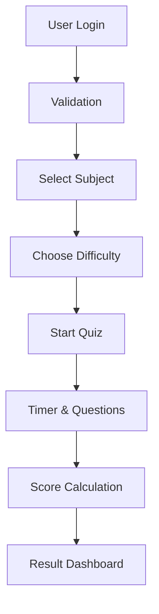

<div align="center">

# 🎓 QUIZ CHALLENGE PORTAL

### 🚀 Smart Interactive Quiz Platform


<br>
<br>

### 🌐 LIVE WEBSITE

# 🚀 https://quizchallengewebsite.netlify.app/

<br>

✨ Interactive Learning Through Smart Quizzes

---

</div>

# 📌 About The Project

Quiz Challenge Portal is a modern and interactive web application designed to help users test and improve their knowledge through engaging quizzes.

The platform provides:

- 🎯 Subject-wise quiz system
- 📊 Dynamic performance tracking
- ⏱️ Timer-based challenges
- 🧠 Multiple difficulty levels
- 📱 Responsive modern UI
- 🏆 Result analytics dashboard

---

# ✨ Major Features

## 🎨 Modern UI/UX
- Glassmorphism Design
- Animated Background
- Responsive Layout
- Smooth Hover Effects
- Professional Dashboard

---

## 🔐 User Validation System
- Name Validation
- Email Validation
- Phone Number Validation
- User Verification

---

## 📚 Subjects Included

| 📘 Subject | 🎯 Difficulty Levels |
|---|---|
| 🐍 Python | Easy / Medium / Hard |
| ⚛️ Physics | Easy / Medium / Hard |
| 🧪 Chemistry | Easy / Medium / Hard |
| 🤖 Artificial Intelligence | Easy / Medium / Hard |
| 📐 Mathematics | Easy / Medium / Hard |
| 💻 C Programming | Easy / Medium / Hard |

---

# 🧠 Quiz Structure

Each subject contains:

| Level | Questions |
|---|---|
| 🟢 Easy | 10 Questions |
| 🟡 Medium | 10 Questions |
| 🔴 Hard | 10 Questions |

## 📌 Total Questions: 180

---

# 🚀 Functionalities

✅ Dynamic Question Rendering  
✅ Real-Time Timer  
✅ Progress Bar Tracking  
✅ Auto Score Calculation  
✅ Circular Result Indicator  
✅ Grade System  
✅ Performance Dashboard  
✅ Difficulty Level Selection  
✅ Responsive Mobile Design

---

# 📸 User Flow



---

# 🛠️ Technologies Used

| Technology | Purpose |
|------------|----------|
| HTML5 | Structure |
| CSS3 | Styling |
| JavaScript | Functionality |
| Glassmorphism UI | Modern Design |
| Responsive Design | Mobile Compatibility |

---

# 📂 Project Structure

```bash
Quiz-Challenge-Portal/
│
├── index.html
├── style.css
├── script.js
├── data.js
├── README.md
└── .gitignore
```

---

# ⚙️ Installation & Setup

## 1️⃣ Clone Repository

```bash
git clone https://github.com/YOUR_USERNAME/Quiz-Challenge-Portal.git
```

---

## 2️⃣ Open Project

```bash
cd Quiz-Challenge-Portal
```

---

## 3️⃣ Run Project

Open:

```bash
index.html
```

OR run using VS Code Live Server.

---

# 🌐 Deployment

## 🚀 Netlify

🔗 Live Link:

https://quizchallengewebsite.netlify.app/

---

# 📱 Responsive Design

The application is fully responsive across:

* 💻 Desktop
* 📱 Mobile
* 📟 Tablets
* 🖥️ Large Screens

---

# 🏆 Future Enhancements

* 🔥 Firebase Integration
* 📈 Leaderboard System
* 📜 Certificate Generation
* 👨‍💻 Admin Dashboard
* 🌙 Dark / Light Mode
* 📊 Quiz Analytics
* 🧠 AI Generated Questions

---

# 👨‍💻 Developed By

## 💻 Tejashwini.S.Patil

✨ Passionate About  
Web Development • UI/UX • Programming • Innovation

---

# ⭐ If You Like This Project, Give It A Star ⭐